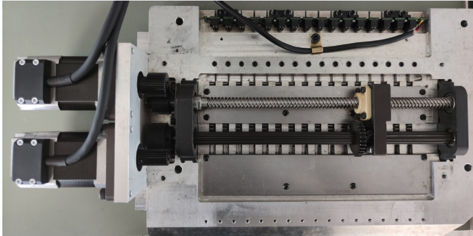

#               双轴剪线伺服问题记录 
****
##### 1:软件相关机械结构参数  
**出刀电机：齿轮传动比例1：2**  
**平移电机：齿轮传动比例1:1--丝杆螺距:12mm**     
  
##### 2:伺服电机通讯指令与手册描述误差  

```markdown
                               4         5              6          7     
 1: 0x02 Motor_ID 0X8002  运动正方向:0顺时针 1逆时针  归零方向:0顺时针 1逆时针  
  实际测试现象,仅运动正方向（位 4-5）影响归零方向 归零方向（位6-7）无效
  解决方案:修改协议版本支持方（0x800e）
 2:0x02 0x8004 设置撞停后编码器值 （撞停后先设置编码值在走偏移量)  
 
 3:电机刚性与运动指令带下去的转矩值成比例关系（正）PID自动调节，非高要求场合不用设置
 
 4:设置编码器输出比例 设置1：1电机默认2048个脉冲转一圈  

 5:指令0x78 Motor_ID 1  归零完成后自动回复 只生效一次回零且发送完撞零后才能发 

```  
#### 3:剪刀回零步骤
==**16个剪刀位仅靠共用一个到位传感器检测，因此上电检测到，未到位的剪刀需要全部回零一边；剪刀顺序从电机安装位置开始第一个 以此类推16个步骤如下**==
```
1:先将剪刀出到底
2：平移出齿轮啮合
3：将剪刀电机逆时针撞零螺丝位置
4：平移回齿轮啮合
5：收刀
6：重复平移1--5步骤16个剪刀全部回零  
```
#### 4:平移电机回零步骤
==由于上电后平移丝杆可能再任何位置,有卡顿堵转风险==
```
1:确认剪刀电机撞零完成
2:平移电机运动到电机安装位置撞停
```
##### 2022/08/03 修改剪刀电机机械撞零方式（取消机械硬限位） 增加光电传感器作为找零参考  
##### 2022/08/05 修改回零最大行程计算方式，改用第一与第16位移动时间测量  
##### 2022/08/08 增加回零卡顿多次尝试方式  
##### 2022/09/07 重构增加了函数接口以适应左右两种方向的兼容  
 


